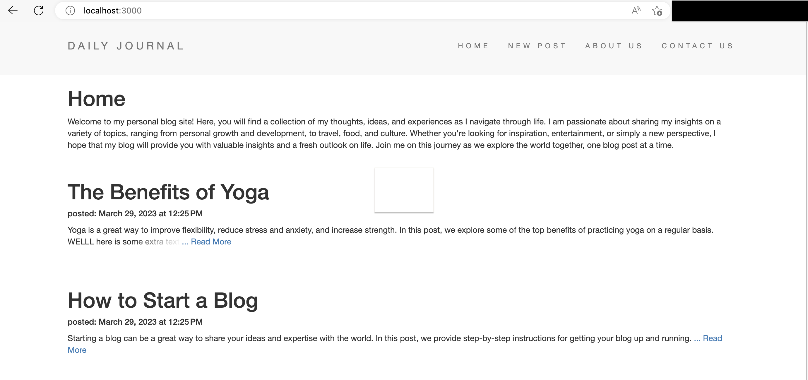

# My Daily Blog Site
Welcome to my simple daily blog site on GitHub! This site is built using HTML, CSS, JavaScript, ExpressJS, NodeJS, and MongoDB with Mongoose.

## Getting Started
To use the web app, you will need to make changes to the .env_example file. 

1. Rename file from .env_sample to .env
2. Open the file and add your own MongoDB Atlas username under db_USER, MongoDB Atlas password under db_PW, and the MongoDB Atlas cluster address to db_cluster. You will also need to add your own database name under db. 
3. Alternatively, you can directly add a link to connect your local or remote mongoDB database by editing the connectionString variable inside "./models/connect.js"
4. Run "npm install" to install all the dependencies
5. Run "node app.js" to start the server

## Pre-filling Page Content (not including blog posts)
You can pre-fill the home page, about page, and contact page by visiting app.address:3000/addpagecontent. This will add content to the database and load it into the respective pages.

## Adding Sample Posts
To add example posts to your blog, visit app.address:3000/addsampleposts. This will add many sample blog posts into your database and load the home page.

## Managing Your Blog
Once you have pre-filled your pages and added sample posts, you can begin managing your blog. You can add new posts, edit existing ones, or delete them as needed.

## Conclusion
That's it! With these simple steps, you can get started with your very own daily blog site on GitHub. Happy blogging!